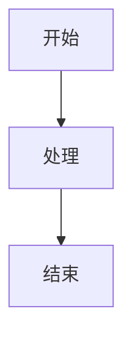

# MDEdit 功能完善检查与优化设计建议 01

## 1. 检查对象

本次检查对象：

- `MDEdit.html`
- `README.md`

检查目标：

- 判断当前功能是否完善。
- 检查 `README.md` 与实际功能是否一致。
- 梳理现有功能成熟度。
- 找出更值得做的功能设计方向。
- 给出后续优化优先级。

## 2. 项目现状结论

MDEdit 当前已经不是一个简单 Markdown 编辑器，而是一个功能较完整的“单文件本地 Markdown 工作台”。

当前能力覆盖了：

- Markdown 编辑。
- 实时预览。
- 多格式导入。
- 多格式导出。
- 本地资料库。
- IndexedDB 存储。
- 文档搜索。
- 大纲导航。
- AI 助手。
- AI 记忆系统。
- 富文本复制。
- 公众号排版复制。
- 本地图片管理。
- SVG 图表渲染与折叠。
- 自动草稿保存和恢复。
- 暗色模式。
- 面板宽度拖拽。
- 编辑/预览布局切换。

整体看，基础功能已经比较完善。后续重点不应该继续无序堆功能，而应该围绕以下方向优化：

- 产品化体验。
- 文档与实现一致性。
- 大文件和长文稳定性。
- AI 工作流可控性。
- 导入导出质量。
- 本地资料库管理能力。
- 中英文切换和未来商业化扩展预留。
- 单文件代码的长期维护能力。

## 3. 当前功能成熟度

### 3.1 编辑能力：较完善

已具备能力：

- Markdown 文本编辑。
- 实时预览。
- 标题、粗体、斜体、删除线、代码、链接、图片、列表、引用、表格、分割线、任务列表快捷插入。
- `Ctrl/Cmd + S` 保存。
- `Ctrl/Cmd + B` 加粗。
- `Ctrl/Cmd + I` 斜体。
- `Tab` 缩进。
- `Shift + Tab` 反缩进。
- 列表自动续行。
- 有序列表自动递增。
- 任务列表回车后自动重置为未勾选。
- SVG 和 base64 图片折叠/展开。

当前短板：

- 缺少当前文档内搜索和替换。
- 缺少命令面板。
- 缺少版本历史。
- 缺少 Markdown 模板中心。
- 对超长文档的性能优化还可以继续加强。

### 3.2 预览能力：较完善

已具备能力：

- 标准 Markdown 渲染。
- 代码高亮。
- SVG 代码块直接渲染。
- DOMPurify 安全过滤。
- 代码块复制按钮。
- 滚动同步。
- 公众号/WPS 富文本复制。
- SVG 复制为公众号占位文案。

当前短板：

- 缺少 Mermaid 支持。
- 缺少数学公式支持。
- 缺少当前阅读位置对应大纲高亮。
- 缺少预览主题选择。
- 缺少打印/导出专用预览模式。

### 3.3 文档管理：中高

已具备能力：

- IndexedDB 本地文档库。
- 打开文档自动保存到本地资料库。
- 资料库列表。
- 资料库排序。
- 资料库打开文档。
- 资料库删除文档。
- 文档搜索。
- 搜索结果高亮。
- 搜索结果打开和删除。

当前短板：

- 缺少标签。
- 缺少文件夹。
- 缺少星标/收藏。
- 缺少批量删除。
- 缺少资料库备份导出。
- 缺少资料库备份恢复。
- 缺少文档版本历史。
- 缺少文档重命名。
- 缺少文档复制副本。

### 3.4 导入导出：能力强，但存在命名和精细度问题

已具备导入能力：

- PDF 转 Markdown。
- Word `.docx` 转 Markdown。
- Excel `.xlsx` / `.xls` / `.csv` 转 Markdown 表格。
- PPT `.pptx` 转 Markdown。
- 拖放文件自动识别导入。

已具备导出能力：

- HTML。
- Word 兼容格式。
- PDF 打印。
- 富文本复制。
- 公众号排版复制。

当前短板：

- README 写的是 `DOCX`，但代码实际生成 `.doc`。
- Word 导入 UI 的 accept 包含 `.doc`，但代码实际不支持 `.doc`。
- PDF 导入主要提取文本，复杂版式、图片和表格保真度有限。
- PPT 导入主要提取文本，图片、图表、布局保留有限。
- Excel 导入表格简单直接，但缺少工作表选择、范围选择、空行处理选项。
- 导出缺少“导出 Markdown”入口，虽然保存本身就是 Markdown，但用户在导出弹窗里可能会期待看到。
- 导出前缺少文件名确认和导出配置。

### 3.5 AI 助手：功能丰富

已具备能力：

- OpenAI 兼容 API 调用。
- 自动补全 `/v1/chat/completions` endpoint。
- 支持 API Key、本地模型名、最大输出长度、温度、上下文 token 上限、CORS 代理设置。
- 流式输出。
- 停止生成。
- 快捷操作：创建文档、续写、润色、摘要、翻译英文、翻译中文、修正语法、扩展、生成大纲、生成图表。
- AI 回复支持替换编辑器、追加到编辑器、复制内容。
- 实际代码还支持“插入到光标”。
- AI 记忆系统使用 IndexedDB。
- 支持工作记忆、摘要记忆、归档记忆。
- 支持相关历史检索。
- 支持新对话和清除记忆。

当前短板：

- 缺少“测试连接”按钮。
- 缺少模型可用性检测。
- 缺少多个模型配置预设。
- 缺少选择性上下文控制。
- 缺少只处理选中文本的 AI 工作流。
- 缺少 Prompt 模板库。
- 缺少 AI 请求 token 预估和用量提示。
- 缺少隐私提示，例如是否会把全文发送给 AI。
- 缺少对非 OpenAI 标准流式格式的兼容策略说明。

### 3.6 README：覆盖较全，但有遗漏和不一致

README 的中英文结构比较完整，已覆盖大部分主要功能。

但当前 README 还缺少或需要修正：

- 没有充分说明 `另存为`。
- 没有说明 SVG/图片折叠功能。
- 没有说明 AI 回复可以“插入到光标”。
- 没有说明 AI 设置里的 CORS 代理。
- 没有说明公众号复制中的 SVG 占位模式。
- 没有说明 `?file=xxx.md` 的 HTTP 自动加载能力。
- 没有说明拖放图片会转为 base64 并折叠。
- `DOCX` 描述与实际 `.doc` 导出不一致。
- 中文资料库部分有“主版器”“本地内存”等不够专业的表达。

## 4. 需要优先修正的不一致点

### 4.1 导出格式名称不一致

代码中 `exportDocx()` 实际生成：

- 文件扩展名：`.doc`
- MIME：`application/msword`
- 内容：HTML 包装的 Word 兼容文档

但 README 中写的是：

- `DOCX`
- Word 原生格式

这会误导用户。

建议二选一：

- 短期方案：把 README 和 UI 改成 `DOC / Word 兼容格式`。
- 长期方案：真正实现 `.docx` 打包导出。

### 4.2 Word 导入 `.doc` 支持描述不清

代码中：

- `triggerImport('word')` 的 accept 包含 `.docx,.doc`。
- `importWord()` 遇到 `.doc` 会直接报错，提示用户先另存为 `.docx`。

建议：

- UI 文案明确写成 `Word (.docx)`。
- 如果保留 `.doc` accept，则弹窗说明“旧版 .doc 会提示转换”。
- 更推荐只接受 `.docx`，避免误导。

### 4.3 拖放文件夹能力需要确认

README 写支持拖放整个文件夹，自动识别 MD 和图片。

但当前 drop 主逻辑主要处理：

- `e.dataTransfer.files[0]`

如果浏览器没有自动展开目录，用户拖文件夹时可能体验不一致。

建议：

- 短期：README 改为“部分浏览器支持拖放文件夹”。
- 长期：使用 `webkitGetAsEntry()` 递归读取目录。

### 4.4 README 中文表达需要优化

当前资料库部分有不够专业的表达：

- “主版器”应改为“主编辑器”。
- “本地内存”应改为“本地资料库”或“IndexedDB”。
- “一劳永逸啦”等表达可以更正式。

## 5. 最值得做的功能设计

## 5.1 P0：产品完整性修正

### 5.1.1 修正导出格式对齐

任务：

- 修正 README 中 `DOCX` 表述。
- 修正导出弹窗中的 Word 格式说明。
- 如果暂不实现真正 docx，则统一称为 `DOC / Word 兼容格式`。
- 如果决定实现真正 docx，则新增标准 docx 生成逻辑。

建议优先级：高。

原因：

- 这是当前最明显的文档与功能不一致点。
- 会直接影响用户信任。

### 5.1.2 增加 AI 设置“测试连接”按钮

任务：

- 在 AI 设置弹窗增加 `测试连接` 按钮。
- 测试 endpoint 是否可访问。
- 测试 API Key 是否有效。
- 测试模型名是否可用。
- 返回明确错误，例如：
  - API Key 无效。
  - 模型不存在。
  - CORS 错误。
  - 网络不可达。
  - 上游服务不可用。

建议优先级：高。

原因：

- AI 是核心卖点。
- 当前用户配置失败后很难判断是 Key、模型、base_url、CORS 还是上游问题。

### 5.1.3 增强资料库管理

任务：

- 增加资料库备份导出。
- 增加资料库备份恢复。
- 增加批量删除。
- 增加清空资料库。
- 增加删除前二次确认。
- 增加文档重命名。
- 增加复制副本。

建议优先级：高。

原因：

- 当前 IndexedDB 已经是重要数据资产。
- 没有备份/恢复会让用户长期使用有风险。

### 5.1.4 README 同步实际功能

任务：

补充以下实际存在但文档不足的功能：

- `另存为`。
- SVG/图片折叠。
- AI 回复插入到光标。
- CORS 代理设置。
- 公众号 SVG 占位复制。
- HTTP 模式 `?file=xxx.md` 自动加载。
- 拖放图片转 base64 并折叠。

建议优先级：高。

原因：

- README 是产品说明和 GitHub 首页，应该准确体现产品能力。

## 5.2 P1：提升写作工作流

### 5.2.1 当前文档搜索与替换

当前搜索是资料库搜索，不是当前文档内搜索。

建议增加：

- 当前文档查找。
- 替换。
- 全部替换。
- 大小写匹配。
- 正则匹配。
- 高亮所有匹配项。
- 显示当前第几个匹配。

建议优先级：高。

原因：

- 对长文编辑非常重要。
- Markdown 编辑器用户很常用。

### 5.2.2 命令面板

建议新增 `Ctrl/Cmd + K` 命令面板。

可执行命令：

- 新建文档。
- 打开文件。
- 保存。
- 另存为。
- 导出。
- 搜索资料库。
- 当前文档搜索。
- 打开大纲。
- 切换主题。
- 切换布局。
- AI 润色。
- AI 摘要。
- AI 翻译。
- 插入表格。

建议优先级：中高。

原因：

- 工具栏按钮越来越多，命令面板可以避免界面继续拥挤。

### 5.2.3 大纲增强

建议增强：

- 当前标题高亮。
- 支持折叠层级。
- 支持一键复制目录。
- 支持一键插入 Markdown 目录。
- 支持拖拽标题重排，并移动对应正文段落。

建议优先级：中。

原因：

- 适合长文、报告、技术文档。

### 5.2.4 版本历史

建议新增：

- 每次保存生成版本。
- 每隔一定时间生成自动版本。
- 显示版本列表。
- 版本对比。
- 恢复某个版本。
- 删除旧版本。

建议优先级：中高。

原因：

- 当前只有草稿恢复和资料库，没有真正版本线。
- 长文写作容易误改，版本历史非常有价值。

## 5.3 P1：AI 工作流增强

### 5.3.1 Prompt 模板库

建议新增用户自定义模板。

模板示例：

- 写周报。
- 写公众号。
- 写小红书文案。
- 写会议纪要。
- 写产品需求文档。
- 写技术方案。
- 生成论文摘要。
- 生成项目复盘。

模板字段：

- 模板名称。
- 模板描述。
- Prompt 内容。
- 是否带全文。
- 是否带选中内容。
- 输出插入方式。

建议优先级：中高。

原因：

- 当前 AI 快捷操作是固定的。
- 让用户自定义后，产品会更贴近个人工作流。

### 5.3.2 选择文本后 AI 操作

建议逻辑：

- 如果用户选中文本，AI 默认只处理选中文本。
- 如果没有选中文本，则询问是否处理全文。

可选结果处理方式：

- 替换选区。
- 插入到选区后方。
- 插入到光标。
- 追加到文末。
- 仅复制。

建议优先级：高。

原因：

- 当前 AI 自由对话会带上全文，长文时成本高、上下文重。
- 选区处理更精准。

### 5.3.3 上下文开关

建议在 AI 面板增加上下文模式：

- 不带正文。
- 带选中内容。
- 带全文。
- 带大纲。
- 带最近修改段落。

建议优先级：高。

原因：

- 当前自动带全文，用户可能不清楚会发送哪些内容给 AI。
- 也涉及隐私和 token 成本。

### 5.3.4 模型预设

建议支持多个 AI 配置：

- DeepSeek。
- Claude。
- OpenAI。
- Gemini。
- 自定义代理。

每个预设保存：

- 名称。
- Endpoint。
- API Key。
- Model。
- Max tokens。
- Temperature。
- CORS proxy。

建议优先级：中。

原因：

- 当前用户每次切换模型需要手动改配置。

### 5.3.5 AI 隐私提示

建议在 AI 面板显著提示：

- 自带 API Key 仅保存在浏览器本地。
- 调用 AI 时会把所选上下文发送给对应 API 服务。
- 用户可选择是否带全文。
- 清除记忆会删除 IndexedDB 中的 AI 历史。

建议优先级：中高。

原因：

- AI 文档编辑涉及隐私。
- 清晰提示可以降低用户顾虑。

## 5.4 P2：高级内容能力

### 5.4.1 Mermaid 支持

建议支持：

```markdown

```

价值：

- 技术文档常用。
- 产品流程、架构图、时序图都适合。

注意：

- 这需要引入第三方库。
- 按项目规则，第三方 API 和组件调用需要先使用 Context7 校验。
- 当前环境没有 Context7 工具，所以本次只做设计建议，不直接引入。

### 5.4.2 数学公式支持

建议支持：

- 行内公式：`$...$`
- 块级公式：`$$...$$`

价值：

- 技术文档、教学文档、论文笔记适用。

注意：

- 需要第三方公式渲染库。
- 后续引入前需要先校验官方调用方式。

### 5.4.3 模板中心

建议内置模板：

- 会议纪要。
- 产品需求文档。
- 技术方案。
- 周报。
- 简历。
- 论文笔记。
- 读书笔记。
- 公众号文章。
- 项目复盘。
- OKR。

模板可以和 AI 结合：

- 选择模板。
- 填写主题。
- AI 自动生成初稿。

### 5.4.4 发布为网页

当前已有 HTML 导出。

后续可以做更产品化的发布：

- 生成独立分享页面。
- 带目录。
- 带主题。
- 可设置标题、作者、日期。
- 可选择阅读模式。
- 支持导出为单文件 HTML。

## 6. 架构建议

当前 `MDEdit.html` 已经超过 5000 行。继续堆功能会导致：

- 查找困难。
- 修改风险变高。
- 功能互相影响。
- 中英文切换更难做。
- 未来付费版或云端版扩展成本变高。

建议分两阶段处理。

### 6.1 第一阶段：仍保持单文件，但按模块组织

暂时不拆构建流程，继续保持 `MDEdit.html` 单文件部署。

但新增功能时，建议严格放入独立模块区域：

- Core Editor。
- Markdown Render。
- Storage / IndexedDB。
- Import。
- Export。
- AI。
- UI Dialog。
- Search。
- Library。
- I18N。
- Utils。

目标：

- 减少交叉修改。
- 降低维护风险。
- 为后续拆分做准备。

### 6.2 第二阶段：源码拆分，构建输出仍是单文件

后续可以改成源码结构：

- `src/index.html`
- `src/styles.css`
- `src/editor.js`
- `src/render.js`
- `src/storage.js`
- `src/import.js`
- `src/export.js`
- `src/ai.js`
- `src/search.js`
- `src/library.js`
- `src/i18n.js`
- `src/utils.js`

构建后仍输出：

- `MDEdit.html`

这样可以保持当前部署方式不变：

- `deploy.sh` 继续把 `MDEdit.html` 部署为远端 `index.html`。

## 7. 中英文切换建议

如果后续要做中英文切换，不建议复制两份 HTML。

推荐方式：

- 保留一个 `MDEdit.html`。
- 增加轻量 i18n 字典。
- 静态 HTML 使用 `data-i18n` 标记。
- JS 动态文案统一走 `t(key)`。
- 用户语言偏好存入 `localStorage`。
- 默认语言根据浏览器语言或用户设置决定。

第一阶段可以先做：

- 顶部工具栏。
- 弹窗标题。
- 按钮。
- AI 面板。
- 状态栏。
- Toast。

第二阶段再做：

- 长帮助文案。
- 默认示例文档。
- AI Prompt。
- README 双语同步。

## 8. 推荐下一步执行顺序

### 第 1 步：修正 README 与实现不一致

优先修：

- DOCX/DOC 表述。
- `.doc` 导入说明。
- 资料库中文表述。
- 补充实际已有但 README 漏写的功能。

### 第 2 步：增加 AI 测试连接

优先做：

- endpoint 测试。
- API Key 测试。
- model 测试。
- CORS 错误提示。
- 上游错误展示。

### 第 3 步：增加当前文档搜索/替换

优先做：

- 查找。
- 替换。
- 全部替换。
- 匹配数量。
- 当前匹配定位。

### 第 4 步：增强资料库

优先做：

- 备份导出。
- 备份恢复。
- 批量删除。
- 重命名。
- 星标。

### 第 5 步：做轻量 i18n 基础设施

优先做：

- `t(key)`。
- `I18N` 字典。
- `applyLanguage()`。
- 语言切换按钮。
- `localStorage` 保存语言偏好。

### 第 6 步：准备内部模块化

优先做：

- 不一定马上拆文件。
- 先把新增代码放到清晰模块区域。
- 避免继续无序追加。

## 9. 总结

### 9.1 当前功能是否完善

基础功能已经比较完善，甚至已经超过普通 Markdown 编辑器。

尤其突出的是：

- AI 助手功能完整度较高。
- 导入导出覆盖面较广。
- 本地资料库已经使用 IndexedDB。
- 富文本复制和公众号场景比较有特色。
- SVG 图表支持是差异化亮点。

### 9.2 当前最大问题

当前最大问题不是功能少，而是：

- README 与实现存在少量不一致。
- `MDEdit.html` 继续变大，维护压力升高。
- AI 配置缺少测试连接，用户排错困难。
- 当前文档内搜索替换缺失。
- 资料库缺少备份恢复。
- 部分高级能力还没有产品化入口。

### 9.3 最值得优先做的优化

建议优先级最高的 5 件事：

1. 修正 README 与实际功能不一致。
2. 增加 AI 测试连接。
3. 增加当前文档搜索/替换。
4. 增强资料库备份与恢复。
5. 建立中英文切换基础设施。

### 9.4 最终建议

短期不要大拆架构，也不要立刻做复杂付费版。

更合理的路线是：

- 先修正文档和命名问题。
- 再补齐高频写作功能。
- 然后增强 AI 的可控性和可配置性。
- 接着做资料库备份恢复。
- 最后做 i18n 和源码模块化。

这样可以在不破坏当前单文件优势的前提下，让 MDEdit 从“功能很多”进一步升级为“体验完整、可维护、可长期发展的产品”。

## 10. 本轮优化执行记录

执行时间：2026-05-04

### 10.1 已完成优化

本轮已经根据前文建议完成以下核心优化：

1. README 与实现一致性修正：
   - 将导出格式从误导性的 `DOCX` 统一修正为 `DOC / Word 兼容格式`。
   - 导出弹窗中同步显示 `导出为 DOC`。
   - Word 导入统一为仅支持 `.docx`。
   - 拖放 `.doc` 文件时给出“请先另存为 `.docx`”提示。
   - README 补充 `另存为`、SVG/图片折叠、CORS 代理、公众号 SVG 占位复制、`?file=xxx.md` 自动加载、拖放图片 base64 折叠等实际能力。

2. AI 设置与 AI 工作流增强：
   - 在 AI 设置弹窗新增 `测试连接` 按钮。
   - 支持测试 API Endpoint、API Key、模型名称是否可用。
   - 增加网络错误、CORS 错误、上游错误提示。
   - 增加 AI 隐私提示，说明 API Key 本地保存，以及 AI 请求会发送当前请求、相关上下文或选中 Markdown 内容到用户配置的 API 地址。
   - 当编辑器存在选中文本时，润色、翻译、摘要、修正语法、扩展等快捷操作优先只处理选中内容；无选区时保持处理全文。

3. 资料库增强：
   - 新增资料库 JSON 备份导出。
   - 新增资料库 JSON 备份恢复。
   - 新增文档重命名。
   - 新增复制副本。
   - 新增清空资料库，并在高风险操作前增加二次确认。

4. 当前文档查找/替换：
   - 新增 `查找` 工具栏入口。
   - `⌘/Ctrl + F` 打开当前文档查找/替换。
   - `⌘/Ctrl + Shift + F` 打开文档库搜索。
   - 支持上一个、下一个、区分大小写、替换当前、全部替换和匹配数量显示。

5. 大纲增强：
   - 大纲面板新增 `复制` 目录按钮。
   - 大纲面板新增 `插入` 目录按钮。
   - 目录从当前 Markdown 标题生成，并忽略代码块中的标题符号。

### 10.2 已同步文件

本轮主要更新：

- `MDEdit.html`
- `README.md`
- `优化01.md`

### 10.3 检查结果

已完成以下本地检查：

- JavaScript 解析检查：通过。
- 关键功能引用检查：通过。
- README 与实现一致性检查：通过。

### 10.4 部署说明

当前项目的 `deploy.sh` 部署逻辑为：

- 将本地 `MDEdit.html` 同步为远程 `/opt/mdedit-pwa/index.html`。
- 将本地 `README.md` 同步到远程 `/opt/mdedit-pwa/README.md`。
- 重启远程 `pm2` 服务 `mdedit-pwa`。

注意：`deploy.sh` 默认不会同步 `优化01.md`。本轮根据“更新 `优化01.md` 并部署”的要求，会额外将 `优化01.md` 同步到远程 `/opt/mdedit-pwa/` 目录，作为本次优化记录留档。

### 10.5 后续仍建议继续优化

本轮已完成 P0 中的大部分产品完整性修正。后续建议继续：

1. 增加模型配置预设和更细粒度的上下文发送控制。
2. 增加 Mermaid 和数学公式支持。
3. 逐步建设轻量 i18n 基础设施和内部模块化结构。

### 10.6 连接测试 HTTP 404 反馈修正

用户在部署后反馈：

- `连接测试失败：HTTP 404`

本轮追加修正：

- `测试连接` 现在会读取响应文本，优先展示上游返回的 JSON 错误或文本错误体。
- 针对 `HTTP 404` 增加明确提示：
  - 可能是 API Endpoint 路径不存在。
  - 可能是模型名称不存在。
  - 显示当前实际请求的 Endpoint。
  - 提示用户确认地址是否为完整 Chat Completions 地址。
- `normalizeEndpoint()` 增强：
  - 输入 `https://xxx` 时自动补全为 `https://xxx/v1/chat/completions`。
  - 输入 `https://xxx/v1` 时继续自动补全为 `https://xxx/v1/chat/completions`。
- README 已同步 base_url 自动补全说明。

### 10.7 继续完成：文档版本历史

根据后续优化建议，本轮继续完成“文档版本历史”：

- IndexedDB 文档库版本升级到 `3`。
- 新增 `versions` 对象存储，用于保存文档版本记录。
- 每篇文档最多保留最近 `20` 个版本，超出后自动清理旧版本。
- 在以下场景自动记录版本：
  - 打开文件。
  - 手动保存。
  - 另存为。
  - 导入文件。
  - 自动加载 `?file=xxx.md`。
  - 导出 HTML 时写入资料库。
  - 资料库写入、复制副本、导入备份。
  - 恢复版本。
- 新增工具栏 **「版本」** 入口。
- 新增版本历史面板，支持：
  - 查看当前文档版本列表。
  - 恢复指定版本。
  - 复制指定版本内容。
  - 删除单个版本。
  - 清空当前文档版本。
- 恢复版本前会自动把当前编辑器内容备份为一个版本，降低误恢复风险。
- 删除文档、清空资料库时会同步清理相关版本记录。
- 重命名文档时会迁移版本记录。
- README 已同步中英文说明。

### 10.8 继续完成：资料库标签、星标、分类和批量操作

根据后续优化建议，本轮继续完成资料库二次增强：

- 文档资料库记录扩展元数据：
  - `starred`：是否星标。
  - `tags`：标签数组。
  - `folder`：分类/文件夹名称。
- 保存文档时会保留已有星标、标签和分类元数据。
- 资料库面板新增筛选输入框：
  - 支持按文件名筛选。
  - 支持按标签筛选。
  - 支持按分类/文件夹筛选。
- 资料库面板新增星标筛选。
- 每个文档条目新增操作：
  - 星标/取消星标。
  - 编辑标签。
  - 编辑分类/文件夹。
- 资料库面板新增选择能力：
  - 可选择单个文档。
  - 可一键全选/取消当前筛选结果中的文档。
  - 显示当前已选数量。
- 新增批量操作：
  - 批量导出选中文档为 JSON。
  - 批量删除选中文档，并带二次确认。
- 全量备份和批量备份都会保留星标、标签、分类等元数据。
- 导入备份时会恢复这些元数据。
- 清空资料库后会同步清空当前选择状态。
- README 已同步中英文说明。

### 10.9 继续完成：AI Thinking 模式开关

针对用户问题：

- AI 对话是否为流式输出。
- Thinking 部分是否输出。
- 设置中是否可以打开/关闭 Thinking 模式。

本轮确认并完成：

- AI 对话本身已经是流式输出，请求体使用 `stream: true`，前端按 SSE 增量读取并实时渲染。
- 原逻辑只读取 `choices[0].delta.content`，没有展示 thinking/reasoning 类字段。
- AI 设置弹窗新增 **Thinking 模式** 开关。
- 保存 AI 设置时会持久化 `thinkingEnabled`。
- 测试连接会尊重 Thinking 模式：
  - 开启时请求体带 `enable_thinking: true`。
  - 关闭时保持普通测试请求。
- 正式 AI 对话请求体也会在开启 Thinking 模式时带 `enable_thinking: true`。
- 流式解析新增兼容字段：
  - `delta.reasoning_content`
  - `delta.reasoningContent`
  - `delta.thinking`
  - `delta.reasoning`
  - 顶层 `reasoning_content`
  - 顶层 `thinking`
- Thinking 内容会在 AI 回复顶部以折叠块显示。
- 插入到光标、替换编辑器、追加到编辑器、复制内容等操作仍然只使用正式回答内容，不会把 Thinking 内容混入正文。
- README 已同步中英文说明。

### 10.10 继续完成：模型预设、上下文控制、Mermaid 和数学公式

根据继续优化要求，本轮完成两组能力：

#### AI 模型配置预设和上下文发送控制

- AI 设置弹窗新增 **模型配置预设** 下拉。
- 当前预设包括：
  - OpenAI · GPT-4o mini
  - OpenAI · GPT-4o
  - DeepSeek · Chat
  - DeepSeek · Reasoner
  - 通义千问 · Qwen Plus
  - Moonshot · 8K
- 选择预设时会自动填充：
  - API 地址。
  - 模型名称。
  - 最大输出长度。
  - 上下文 token 上限。
  - 温度。
  - Thinking 模式默认状态。
- 预设不会覆盖 API Key。
- AI 设置弹窗新增 **上下文发送控制**：
  - 自由对话是否附带当前编辑器全文。
  - 是否发送 AI 摘要记忆。
  - 是否检索并发送相关历史归档。
  - 是否发送最近对话上下文。
- `buildSmartContext()` 已按这些开关控制摘要记忆、归档检索和最近对话。
- 自由对话已按“附带当前编辑器全文”开关决定是否把编辑器全文拼入用户请求。

#### Mermaid 和数学公式支持

- 新增 Mermaid 图表支持：
  - 使用 <code>```mermaid</code> 代码块书写图表。
  - 预览中按需加载 Mermaid 并渲染 SVG。
  - 暗色模式切换后会重新渲染预览，Mermaid 主题同步切换。
  - Mermaid 渲染失败时会保留原始源码展示，避免阻断预览。
- 新增数学公式支持：
  - 使用 `$...$` 渲染行内公式。
  - 使用 `$$...$$` 渲染块级公式。
  - 使用 KaTeX 渲染公式。
  - 公式预处理会避开代码围栏和行内代码，降低误渲染概率。
- AI 回复最终渲染和历史恢复也复用统一 Markdown 渲染管线，因此 Mermaid 和数学公式同样适用于 AI 回复展示。
- README 已同步中英文说明。

### 10.11 继续完成：AI 设置双列布局和 SVG 右键导出

根据反馈继续优化：

- AI 模型配置弹窗高度过高，超出窗体。
- 预览区域中的 SVG 图需要支持鼠标右键导出。

本轮完成：

- AI 设置弹窗改为响应式双列布局：
  - 桌面端使用两列网格排列字段。
  - 弹窗最大高度限制为视口高度，并启用内部滚动，避免超出窗体。
  - 移动端自动回到单列布局。
- AI 设置字段按功能分组，减少纵向高度：
  - 模型预设 + API Key。
  - API 地址。
  - 模型名称、输出长度、温度、上下文上限。
  - 上下文发送控制。
  - Thinking 模式和 CORS 代理。
- 预览区域新增 SVG 右键菜单：
  - 右键点击预览区内任意 SVG 图可打开导出菜单。
  - 支持导出为 `.svg` 文件。
  - 支持导出为 `.jpg` 图片。
  - 导出 JPG 时使用白色背景，避免透明背景在部分查看器中显示异常。
  - 右键菜单会在点击其他区域、按 Escape 或滚动时自动关闭。
- README 已同步中英文说明。

### 10.12 继续完成：编辑器插入 SVG 文件按钮

根据反馈继续优化：

- 编辑器区域需要增加 **插入 SVG** 按钮。
- 用户可以选择 SVG 文件，并在当前光标处插入。

本轮完成：

- 编辑器格式工具栏新增 **SVG** 按钮。
- 新增独立的隐藏文件选择框 `svgInsertInput`，只用于插入 SVG 文件，不影响原有“打开文件”逻辑。
- 点击 **SVG** 按钮后可选择 `.svg` 文件。
- 读取文件后会校验内容是否为 `<svg>...</svg>`。
- 校验通过后，会以 <code>```svg</code> 代码块形式插入到当前光标位置。
- 插入后立即刷新预览，并保留现有 SVG 渲染、复制富文本、保存和导出链路的兼容性。
- README 已同步中英文说明。

### 10.13 继续完成：顶部菜单分组和 PDF 空白修复

根据反馈继续优化：

- 整理顶部菜单结构，按 **入**、**出**、**管** 进行分组。
- 排查并修复 PDF 导出空白问题。

本轮完成：

- 顶部工具栏新增三个视觉分组：
  - **入**：新建、打开、导入、图片目录。
  - **出**：保存、另存为、导出。
  - **管**：查找、文库搜索、资料库、版本、大纲、AI、支持群。
- 保留右侧视图切换、左右切换和暗色模式按钮，不改变原有功能入口。
- PDF 导出从直接打印当前应用页改为打开专用打印窗口：
  - 使用完整渲染后的 HTML 内容生成打印页面。
  - 避免当前主界面的 `flex`、`overflow`、`contain`、视图模式和隐藏面板样式导致打印空白。
  - PDF、HTML、DOC 导出统一使用展开后的编辑器内容，确保折叠 SVG/图片在导出时还原。
- README 已同步中英文说明。

### 10.14 继续完成：顶部菜单下拉化和 PDF 打印页自动关闭

根据反馈继续优化：

- 顶部菜单分组需要改为下拉模式。
- PDF 另存完成后，对应打开的打印页面需要自动关闭。

本轮完成：

- 顶部工具栏 **入**、**出**、**管** 改为下拉菜单：
  - 点击按钮展开对应菜单。
  - 点击其他区域或按 Escape 会自动收起。
  - 菜单项保留原有功能入口和快捷功能。
- PDF 专用打印页增加自动关闭逻辑：
  - 在主窗口和打印页内同时绑定 `afterprint`。
  - 浏览器打印对话框完成或关闭后，延迟自动关闭打印页。
- README 已同步中英文说明。

### 10.15 继续完成：顶部下拉菜单去掉简称字

根据反馈继续优化：

- 去掉顶部下拉菜单按钮中的 **入**、**出**、**管** 三个字。

本轮完成：

- 顶部下拉按钮只显示 **输入**、**输出**、**管理**。
- 保留下拉菜单结构、功能入口和收起逻辑不变。
- README 已同步中文说明。
